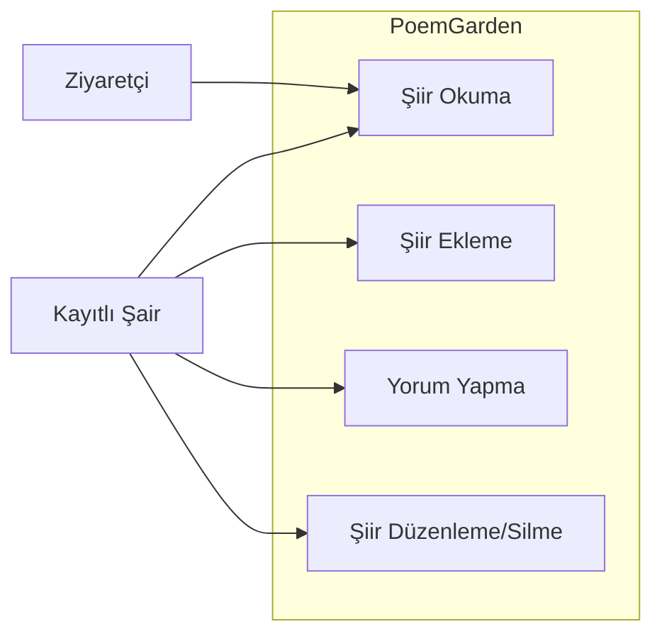
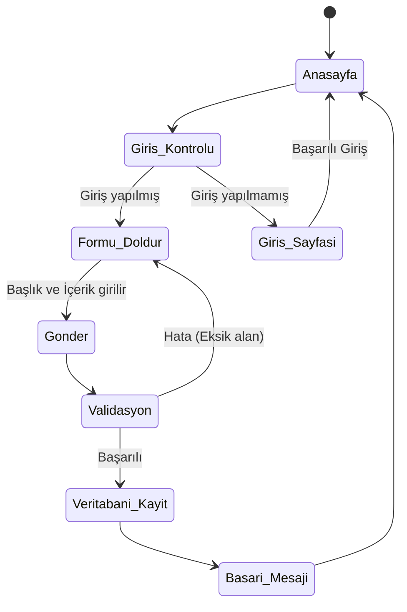
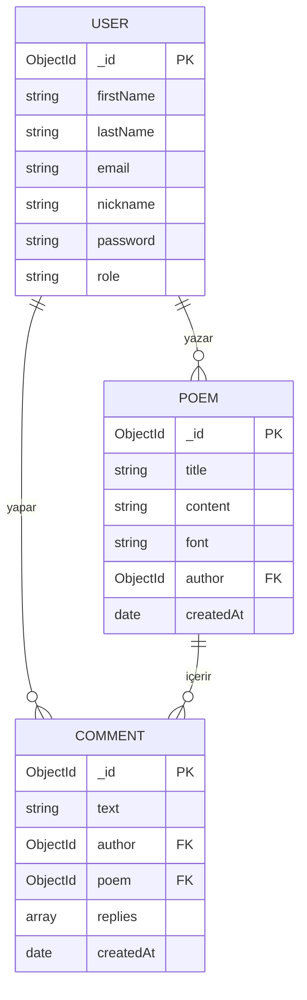
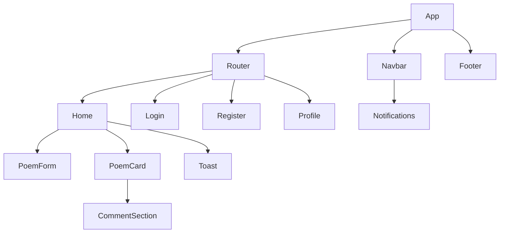

# Dönem Projesi UML ve Tasarım Dokümantasyonu

Bu belge, proje kapsamında geliştirilen mimarinin UML diyagramlarını içermektedir.

## 1. Use-Case Diyagramı
Sisteme giriş yapan bir şairin (Poet) veya yöneticinin (Admin) gerçekleştirebileceği temel işlemleri gösterir.

```mermaid
usecaseDiagram
    actor "Ziyaretçi" as Visitor
    actor "Şair (Kullanıcı)" as User
    actor "Yönetici" as Admin

    Visitor --> (Şiirleri Görüntüle)
    Visitor --> (Kayıt Ol)
    Visitor --> (Giriş Yap)

    User --> (Şiir Ekle)
    User --> (Kendi Şiirini Düzenle)
    User --> (Kendi Şiirini Sil)
    User --> (Yorum Yap)
    User --> (Yanıtlara Cevap Ver)
    User --> (Şiirleri Görüntüle)

    Admin --> (Tüm Şiirleri Sil)
    Admin --> (Kullanıcıları Yönet)
```
*(Not: Mermaid Use-Case tam desteklenmediği için alternatif bir Use-Case grafiği aşağıdadır)*



## 2. Activity Diyagramı (Şiir Ekleme Süreci)
Bir kullanıcının sisteme girip yeni bir şiir ekleme sürecinin akış diyagramı.



## 3. ER Diyagramı (Varlık-İlişki)
Veritabanındaki ana koleksiyonların (User, Poem, Comment) birbirleriyle olan ilişkileri.



## 4. Component Diyagramı (React Bileşenleri)
Uygulamanın Frontend tarafındaki hiyerarşik bileşen ağacı.


