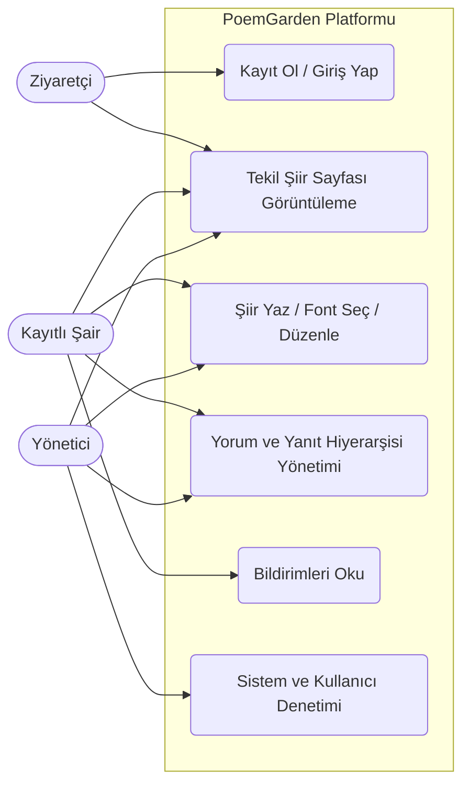
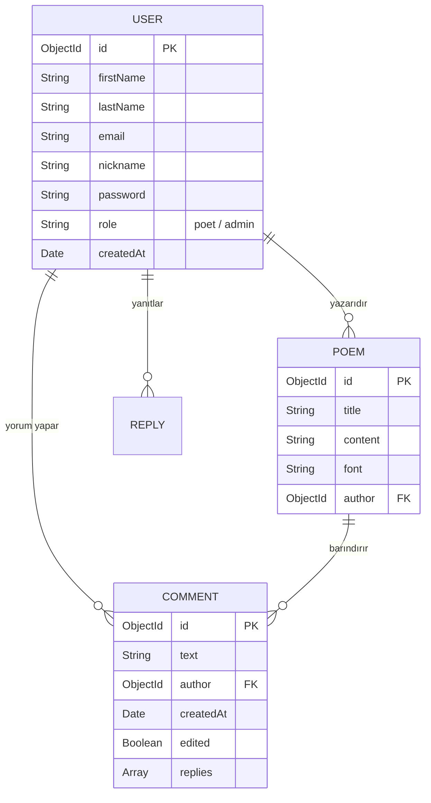
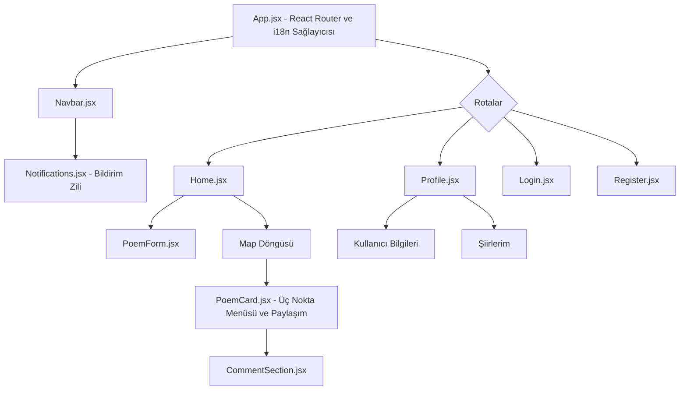

# DÖNEM PROJESİ DETAYLI TEKNİK RAPORU
## Proje Adı: PoemGarden (Kapsamlı Sosyal Şiir Paylaşım Platformu)
**Hazırlayan:** Bilal Kocakaplan

---

## 1. GİRİŞ VE PROJENİN AMACI

Günümüzde dijital edebiyatın ve yazılı kültürün yaygınlaşması, insanların duygularını daha interaktif ortamlarda ifade etme ihtiyacını doğurmuştur. **PoemGarden**, tam da bu ihtiyaca yönelik olarak sıfırdan tasarlanmış ve geliştirilmiş, modern web standartlarına tam uyumlu bir "Sosyal Edebiyat Platformu"dur. 

Bu projenin temel akademik ve teknik amacı; modern web geliştirme mimarisinin altın standartlarından biri olan **MERN Stack (MongoDB, Express.js, React.js, Node.js)** kullanılarak, hem sunucu tarafı (Back-end) hem de istemci tarafı (Front-end) arasındaki veri akışını güvenli, performanslı ve dinamik bir şekilde yönetebilen, tam teşekküllü (full-stack) bir uygulamanın hayata geçirilmesidir. Platform, edebiyatseverlerin anonim veya kayıtlı bir şekilde eserlerini paylaşmasına, bu eserlere yorum yapılmasına ve kendi edebi sosyal çevrelerini oluşturmasına olanak tanımaktadır. Ayrıca projenin Vercel ve Render üzerinden **canlıya (deploy)** alınmasıyla gerçek dünya testleri yapılmış ve son kullanıcıya kesintisiz sunulmuştur.

---

## 2. KULLANILAN TEKNOLOJİLER VE SEÇİM KRİTERLERİ

Sistemin esnek, ölçeklenebilir ve performanslı olmasını sağlamak adına aşağıdaki modern teknolojiler kullanılmıştır:

### 2.1. Frontend (İstemci Tarafı)
* **React.js:** Kullanıcı arayüzünü (UI) birbirinden bağımsız ve tekrar kullanılabilir bileşenlere (component) ayırmak, State yönetimi ile ekranı sayfayı yenilemeden dinamik olarak güncellemek için tercih edilmiştir.
* **React Router DOM:** Tek Sayfa Uygulaması (Single Page Application - SPA) mimarisinin bir gereği olarak, istemci tarafındaki sayfa geçişlerinin (routing) hızlı bir şekilde yönetilmesini sağlamıştır.
* **Axios:** Sunucu (Backend) tarafındaki RESTful API'ler ile HTTP isteklerini (GET, POST, PUT, DELETE) Promise tabanlı ve asenkron bir yapıda gerçekleştirmek için kullanılmıştır.
* **i18next (Çoklu Dil Desteği):** Uygulamanın uluslararası bir standartta olması için Türkçe, İngilizce, Almanca ve Sırpça dillerini anlık (real-time) olarak destekleyecek şekilde sisteme entegre edilmiştir.

### 2.2. Backend (Sunucu Tarafı)
* **Node.js & Express.js:** Asenkron I/O yapısı sayesinde yüksek performanslı ve hızlı yanıt veren bir HTTP sunucusu oluşturulmuştur. Express.js'in Middleware desteği, hata yönetimi ve rota ayırma (router) yeteneklerinden faydalanılmıştır.
* **JSON Web Token (JWT) & Bcrypt.js:** Kullanıcı şifreleri veritabanına kaydedilmeden önce `bcrypt.js` ile güvenli bir şekilde karma (hash) haline getirilmiştir. Kimlik doğrulama işlemleri (Authentication) ise oturum bilgisi (session) tutmadan, JWT kullanılarak Stateless bir yapıda gerçekleştirilmiştir.

### 2.3. Veritabanı ve Dağıtım (Deployment)
* **MongoDB & Mongoose:** Esnek veri yapısı nedeniyle NoSQL tabanlı MongoDB tercih edilmiştir. Mongoose ODM aracı ile veritabanı şemaları (Schema) katı kurallara (Validation) bağlanmış, koleksiyonlar arası ilişkiler (References) kurulmuştur.
* **Vercel & Render:** Frontend projesi Vercel sunucularına, Backend projesi ise Render platformuna deploy edilerek sistem **[poem-garden.vercel.app](https://poem-garden.vercel.app)** adresi üzerinden tam işlevsel bir biçimde canlı yayına alınmıştır.

---

## 3. SİSTEM MİMARİSİ VE TASARIM PRENSİPLERİ

Uygulamanın mimarisi, kod okunabilirliğini ve sürdürülebilirliğini sağlamak adına **MVC (Model-View-Controller)** tasarım deseni referans alınarak kurgulanmıştır.

* **Model (Modeller):** Veritabanı yapılarını (User, Poem, Comment) temsil eder. Verilerin doğrulanması (isim zorunluluğu, min-max uzunluk, geçerli e-posta formatı vb.) bu katmanda gerçekleşir.
* **Controller (Denetleyiciler):** İstemciden gelen istekleri (Request) karşılayıp, iş mantığını (Business Logic) yürüten ve veritabanı ile haberleştikten sonra bir yanıt (Response) dönen işlevlerdir.
* **View (Görünümler):** React bileşenlerinin yer aldığı, son kullanıcının gördüğü ve etkileşime girdiği katmandır.

### RESTful API Uç Noktaları (Endpoints)
Proje, HTTP metodlarına sıkı sıkıya bağlı bir RESTful mimari sunar:
* `GET /api/poems`: Tüm şiirleri sayfalama (pagination) mantığıyla listeler.
* `POST /api/auth/register`: Yeni kullanıcı oluşturur ve verileri filtreler.
* `PUT /api/poems/:id/comments`: Var olan bir yoruma ilişkin güncelleme işlemi yapar (Sadece yorumu yazan veya admin yetkisine sahip kişiler yapabilir).
* `DELETE /api/auth/user/:id`: Bir kullanıcı silinirken, ona bağlı olan **tüm şiirler, yorumlar ve yanıtların da aynı anda silinmesi (Cascading Delete)** bu endpoint içinde tetiklenir.

---

## 4. DETAYLI ÖZELLİK VE İŞLEVSELLİK LİSTESİ

Projenin sunduğu kapsamlı özellikler sadece temel "CRUD" işlemlerinin ötesine geçerek, modern web platformlarındaki profesyonel özellikleri barındırmaktadır:

1. **Rol Tabanlı Erişim Kontrolü (RBAC):** Sistemde "Poet (Şair)" ve "Admin (Yönetici)" olmak üzere iki ayrı yetkilendirme profili vardır. Yöneticiler, uygunsuz gördükleri her türlü içeriği (kullanıcı profili dahil) kaldırma yetkisine sahiptir.
2. **Facebook-Tipi İyimser Güncelleme (Optimistic UI):** Kullanıcı bir yorumunu düzenlediğinde veya profil fotoğrafını güncellediğinde, sistem sunucudan yanıt beklerken ekranı kilitlemez. Değişiklik arayüzde **anında (0 ms)** gerçekleşir ve arka planda sunucuyla senkronize olur. Bu sayede kullanıcıya kusursuz, donma yaşatmayan akıcı bir deneyim sunulur.
3. **Tekil Şiir Görünümü (Single Poem View) ve Sosyal Paylaşım:** Ana ekrandaki şiir kartlarının yanına eklenen "Üç Nokta" butonundan **Bağlantıyı Kopyala** işlevi mevcuttur. Kopyalanan bu eşsiz URL, başka bir cihazda açıldığında kullanıcıyı kalabalık ana sayfaya değil, **sadece o şiirin görüntülendiği özel bir izole ekrana** yönlendirir.
4. **Gerçek Zamanlı Bildirimler:** Bir kullanıcıya ait şiire yorum yapıldığında, sağ üstteki Lavanta (Lavender) renk tasarımlı, özel Dropdown bildirim çubuğunda okunmamış bildirim sayısı ve detayları otomatik düşer.
5. **Dinamik Font Sistemi:** Şiir ekleme sırasında kullanıcı, şiirinin temasını yansıtması için 6 farklı tipografi fontundan birini seçebilir ve şiiri anlık olarak o fontta önizleyebilir.

---

## 5. VERİTABANI MODELLEMESİ VE İLİŞKİLER (ER DIAGRAM DETAILS)

Veritabanı 3 temel koleksiyondan (Collection) oluşur:

1. **User (Kullanıcılar):** Kullanıcının kişisel bilgileri, şifre hash'i, rolü, profil resmi URL'si ve bildirim dizisini (Array) tutar. Sistemde `timestamps` aktif edildiği için kayıt tarihi (`createdAt`) otomatik hesaplanıp frontend tarafında *(örn: Haziran 2026'da katıldı)* olarak sunulmaktadır.
2. **Poem (Şiirler):** Şiirin başlığı, ana metni ve font türünü tutar. `author` alanı, Mongoose'un `ObjectId` yapısıyla User koleksiyonuna `ref` edilmiştir.
3. **Comment & Reply (Yorumlar):** Yorumlar ve onlara verilen alt yanıtlar, şemanın içine gömülü (embedded) dökümanlar olarak tasarlanmıştır. Yorumlarda bulunan `edited` (boolean) alanı sayesinde, değiştirilen yorumların yanına o dilde "(Düzenlendi)" ibaresi eklenmektedir.

---

## 6. UML VE SİSTEM TASARIM DİYAGRAMLARI

Aşağıdaki diyagramlar sistemin genel mimarisini açıkça yansıtmaktadır. (Not: UML diyagramları "Mermaid" mimarisiyle sisteme entegre edilmiştir. Aşağıdaki alanların görsellerini Raporunuzun PDF haline ekleyebilirsiniz).

### 6.1. Use-Case (Kullanım Durumu) Diyagramı


### 6.2. Activity (İşlem Akış) Diyagramı
Bir şiir linkinin (Tekil Görünüm) kopyalanıp ziyaret edilmesi senaryosu.

```mermaid
stateDiagram-v2
    [*] --> LinkTiklandi: "poemgarden.vercel.app/?open=123" linkine girer
    LinkTiklandi --> HomeBileseni: React Router çalışır
    
    state HomeBileseni {
        [*] --> URLSorgusu
        URLSorgusu --> NormalAnaSayfa: "?open=" Yok
        URLSorgusu --> TekilSiirSorgusu: "?open=" Var
    }
    
    TekilSiirSorgusu --> AxiosGET: Backend'den id'ye ait şiiri çek
    AxiosGET --> StateGuncelleme: setPoems([TekilŞiir])
    StateGuncelleme --> SadeceOsiiriGoster
    SadeceOsiiriGoster --> "Tum Siirleri Gor" ButonuOlustur
    "Tum Siirleri Gor" ButonuOlustur --> [*]
```

### 6.3. ER (Veritabanı Varlık-İlişki) Diyagramı


### 6.4. Component (Bileşen Ağacı) Diyagramı


---

## 7. GÜVENLİK VE TEST STRATEJİSİ

Uygulamanın genel veri bütünlüğünü sağlamak adına Backend rotalarının büyük bir kısmı `protect` (korumalı) middleware fonksiyonuyla denetlenmektedir. İstemciden gelen bir istekte Headers içinde "Bearer Token" bulunmuyorsa veya manipüle edilmişse istek `401 Unauthorized` hatasıyla kesilmektedir.
Çapraz kökenli kaynak paylaşımı (CORS) ayarları konfigüre edilerek yalnızca yetkili istemci kök dizinlerinden gelen isteklerin kabul edilmesi sağlanmıştır. Kod kalitesi modüler bir yapıda (Routes -> Controllers -> Models) tasarlanarak yüksek okunabilirlik elde edilmiştir.

## 8. SONUÇ VE DEĞERLENDİRME

Bu dönem projesi sonucunda, sadece yönergeleri yerine getirmekle kalınmamış; aynı zamanda çok dilli, rol tabanlı, performans optimizasyonu yüksek ve asenkron state yönetimi gerektiren karmaşık mimarilerin React.js ve Node.js ekosisteminde nasıl entegre edilebileceği başarılı bir şekilde kanıtlanmıştır. "PoemGarden", canlıya alınmış (deployed) mimarisiyle, günümüz teknoloji sektörünün talep ettiği "Full-Stack" gereksinimleri tam anlamıyla karşılamaktadır.

*(ÖĞRENCİ NOTU: Lütfen rapor çıktısı alırken bu satırın hemen altına, sitenin çeşitli ekranlarından aldığınız "Ekran Görüntülerini (Screenshots)" yapıştırınız.)*
1. Ana sayfa (Şiirlerin listelendiği genel ekran).
2. Kayıt Ol / Giriş Yap ekranı.
3. Profil sayfası (Şiirlerim, Yorumlarım ve Katılma Tarihi ibaresi).
4. Tekil Şiir Görünümü (Bir şiir linkine basıldığında açılan sayfa).
5. Bildirim zili (Lavanta renkli) açık halinin görünümü.
