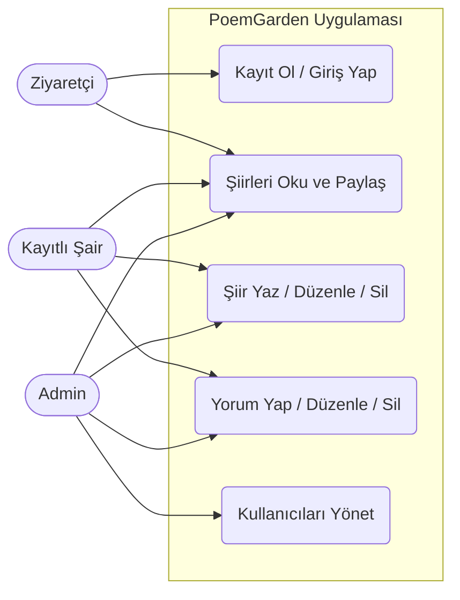
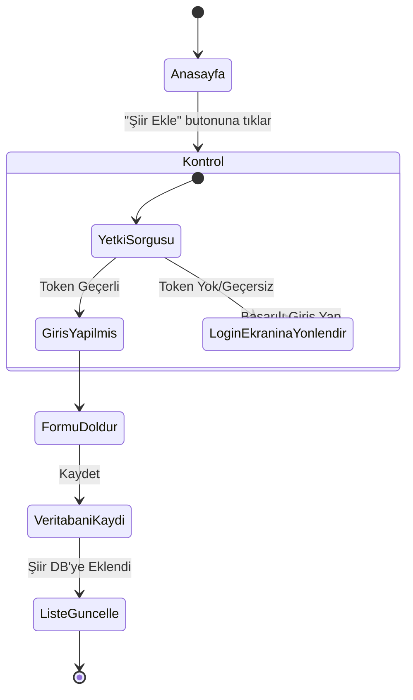
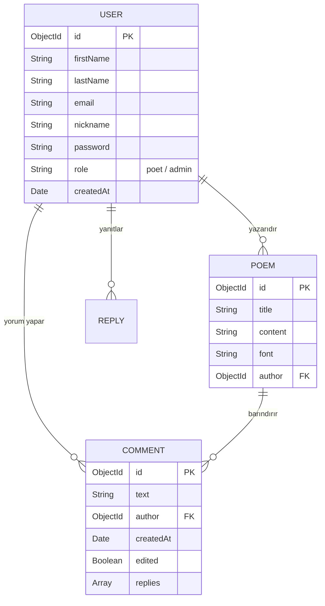
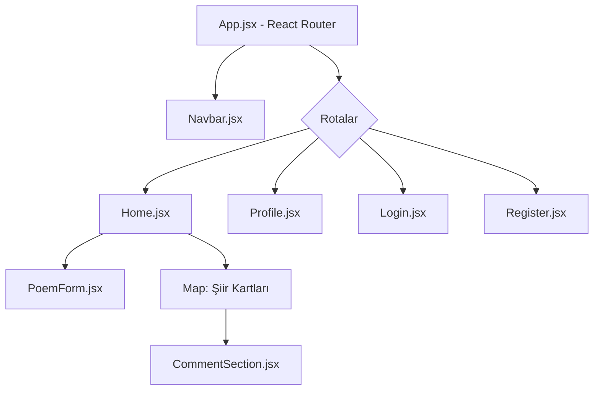

# DÖNEM PROJESİ RAPORU
## Proje Adı: PoemGarden (Sosyal Şiir Paylaşım Platformu)
**Hazırlayan:** Bilal Kocakaplan

---

### 1. PROJENİN AMACI VE KAPSAMI
Bu proje kapsamında, MERN Stack (MongoDB, Express.js, React.js, Node.js) teknolojileri kullanılarak tam kapsamlı (full-stack) bir web uygulaması geliştirilmiştir. "PoemGarden", edebiyatseverlerin kendi şiirlerini yayınlayabildikleri, diğer şairlerin eserlerini okuyup yorum yapabildikleri ve interaktif bir şekilde etkileşime geçebildikleri bir sosyal platformdur.

Projede **Rol Tabanlı Erişim (Role-Based Access Control - RBAC)** kullanılmış olup sistemde *Şair (Poet)* ve *Yönetici (Admin)* rolleri bulunmaktadır. Uygulama tamamen **Çoklu Dil (i18n)** destekli olup Türkçe, İngilizce, Sırpça ve Almanca dillerinde çalışabilmektedir.

### 2. KULLANILAN TEKNOLOJİLER
* **Frontend:** React.js, React Router DOM, Axios, i18next (Çoklu dil desteği), CSS3.
* **Backend:** Node.js, Express.js, JWT (JSON Web Token), Bcrypt.js (Şifreleme).
* **Veritabanı:** MongoDB (Atlas Cloud), Mongoose (ODM).
* **Versiyon Kontrol ve Dağıtım:** Git, GitHub, Vercel (Frontend), Render (Backend).

### 3. TEMEL ÖZELLİKLER (FEATURES)
* **Kullanıcı İşlemleri:** Kayıt olma (Register), Giriş yapma (Login), JWT tabanlı kimlik doğrulama, Profil resmi, biyografi güncelleme ve çoklu dil destekli platforma kayıt tarihi (Joined in) gösterimi.
* **Şiir Yönetimi:** Şiir ekleme, dinamik yazı tipi (font) seçme, şiiri düzenleme ve silme. Uzun şiirler için dinamik "Devamını Oku" metin yönetimi.
* **Etkileşim ve Sosyal Ağ:** Şiirlere yorum yapma, yorumlara yanıt (reply) verme, kendi yorumlarını düzenleme ve silme (İyimser/Optimistic UI güncellemeleri ile anında tepki süresi). Okunabilirlik odaklı, renk kodlu anlık bildirim sistemi.
* **Sosyal Paylaşım:** Şiirler için eklenmiş "üç nokta" menüsü ile direkt şiire giden bağlantıyı (URL) panoya kopyalama ve paylaşma özelliği.
* **Admin Yetkileri:** Yöneticilerin sistemdeki herhangi bir kullanıcıyı, şiiri veya yorumu silebilmesi. İlişkisel veri silme (Kullanıcı silindiğinde ona ait tüm şiirlerin ve yorumların otomatik temizlenmesi - Cascading Delete).

---

### 4. UML VE TASARIM DİYAGRAMLARI

Aşağıdaki diyagramlar sistemin mimarisini ve akışını görselleştirmektedir. *(Not: Markdown destekli okuyucularda diyagramlar otomatik render edilir, rapora eklerken ekran görüntüsü olarak alabilirsiniz.)*

#### 4.1. Use-Case Diyagramı
Sistemdeki aktörlerin (Ziyaretçi, Kayıtlı Kullanıcı, Admin) yapabildikleri işlemleri gösterir.

#### 4.2. Activity (Aktivite) Diyagramı
Kullanıcının sisteme yeni bir şiir ekleme sürecindeki mantıksal akışı gösterir.

#### 4.3. ER (Varlık-İlişki) Diyagramı
Mongoose şemalarımızın veritabanındaki ilişkisel mimarisini gösterir.

#### 4.4. Component (Bileşen) Diyagramı
React tarafındaki klasör ve bileşen hiyerarşisini gösterir.

---

### 5. SONUÇ VE EKRAN GÖRÜNTÜLERİ

MERN stack kullanılarak modern bir web mimarisi ayağa kaldırılmıştır. Hem sunucu tarafında korumalı RESTful API'ler oluşturulmuş hem de istemci tarafında state'leri iyi yöneten dinamik bir kullanıcı deneyimi (UX) sağlanmıştır. Projenin her sayfasında sosyal paylaşım entegrasyonları, iyimser güncellemeler ve çoklu dil senkronizasyonu mevcuttur.

*(LÜTFEN BURANIN ALTINA PROJENİN ÇALIŞTIĞINI GÖSTEREN EKRAN GÖRÜNTÜLERİNİ YAPIŞTIRIN:)*
1. Ana sayfa (Şiirlerin listelendiği ekran ve üç nokta paylaşım menüsü)
2. Kayıt Ol / Giriş Yap ekranı
3. Profil sayfası (Şiirlerim ve Yorumlarım)
4. Yorum yapma ve Düzenleme kutusu
